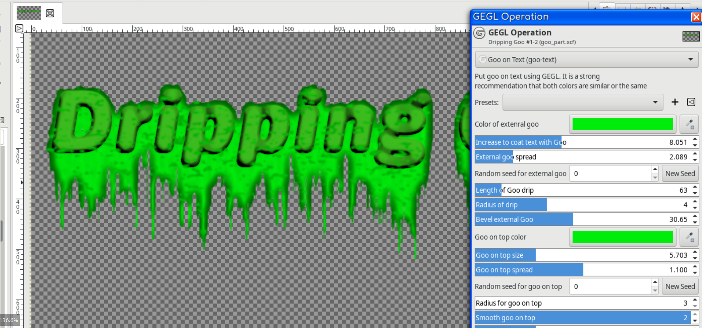
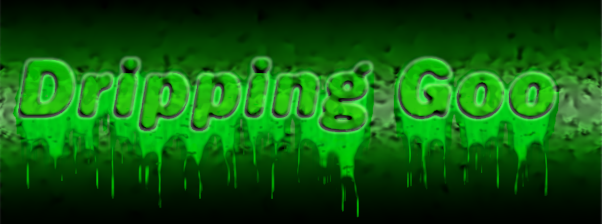

# gegl-goo-on-text
Gimp filter where GEGL puts goo on your text. It works great with my other text styling filters. On Windows and Mac you have to compile. On Linux just put the .so files in /gegl-0.4/plugins.

You must compile gegl:goo-text, gegl:ZZwind and gegl:bevel. ZZWind and Bevel are components of GEGL Goo Text and GEGL Goo Text will not work without them.
GEGL Bevel is a bonus filter that comes with goo-text and a few other of my filters. If you already have gegl:bevel in GEGL Plugins you do not need to recompile it. 
