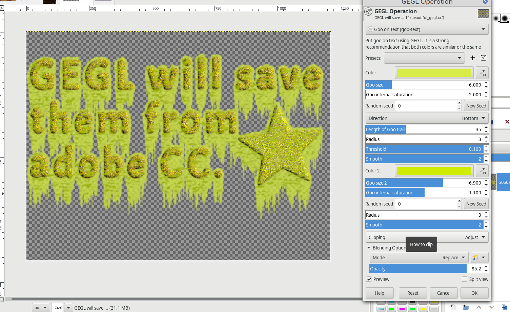

# gegl-goo-on-text
Gimp filter where GEGL puts goo on your text. It works great with my other text styling filters. On Windows and Mac you have to compile. On Linux just put stroke.so in /gegl-0.4/plugins.

Goo text has had an update on June 12 2022. It now requires building mbd (multiplcation of bevels depth) if you already have my custom mbd filter you are good and overwriting or having multiple copies of it should be fine. But please not that the updated version of GEGL mbd is hidden and will not show up anywhere in the menu.
